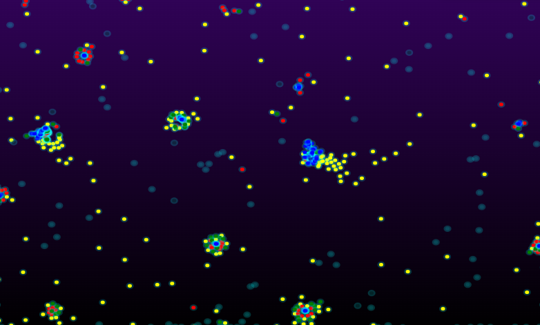

<h1 align="center">Projeto "Partículas Emergentes"&#x1F7E2; &#x1F534; &#x1F7E1; &#x1F535;</h1>

Repositório para hospedar o projeto "Partículas Emergentes".

Este repositório abriga um projeto de simulação de partículas desenvolvido para demonstrar o fenômeno emergente. O objetivo principal do projeto é criar uma simulação interativa que ilustre como comportamentos complexos e emergentes podem surgir a partir da interação simples entre as partículas individuais.

O projeto utiliza linguagens de programação como HTML, CSS e JavaScript, juntamente com a biblioteca Unity 3D e a linguagem de programação C#. Essas ferramentas foram escolhidas para criar uma experiência imersiva e interativa, permitindo aos usuários explorar o fenômeno emergente de forma visualmente atraente.

## Disponivel no Netlify!

1. Abra o seu navegador da web no seu PC.
2. Entre pelo link: https://particulasemergentes.netlify.app/

O repositório contém todo o código-fonte necessário para executar a simulação, bem como arquivos de recursos. Além disso, são fornecidos exemplos e instruções detalhadas para facilitar o entendimento e a utilização do projeto.

## Os principais recursos do repositório incluem:

1. Código-fonte: Todos os arquivos de código necessários para executar a simulação, incluindo scripts em JavaScript controlar o comportamento das partículas e a interação entre elas.
2. Documentação e instruções: Exemplos e instruções detalhadas sobre como configurar e executar a simulação, bem como informações adicionais sobre os conceitos e princípios por trás do fenômeno emergente.

Este repositório visa fornecer uma base sólida para estudantes, desenvolvedores e entusiastas interessados em explorar o fenômeno emergente por meio de simulações interativas. Através da compreensão e manipulação das configurações das partículas, é possível observar e experimentar diferentes comportamentos emergentes, aprofundando o conhecimento nessa área fascinante da ciência. Seja para fins educacionais, de pesquisa ou simplesmente para diversão, este repositório oferece a oportunidade de explorar e compreender o fenômeno emergente de maneira prática e envolvente.

## Feedback

Se você tiver algum feedback, por favor mande um e-mail para dm.arantes.cabral@gmail.com

## Referência

 - [Particle Life Simulation - by Hunar Ahmad](https://github.com/hunar4321/particle-life)

## Autor

Projeto "Partículas Emergentes" foi criado e desenvolvido por [@danieldemac](https://github.com/danieldemac).

